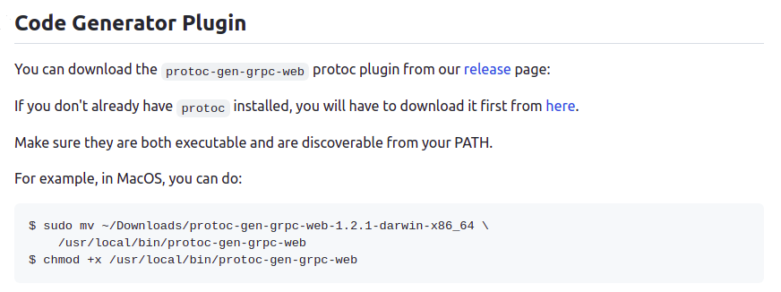
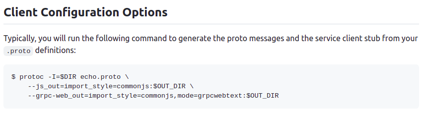

# grpc-web (linux)
- reference  
https://github.com/grpc/grpc-web  
https://github.com/grpc/grpc-web/issues/447  
- enviremant
  - install protoc
    - download from https://github.com/grpc/grpc-web/releases
    - unzip and rename as protoc-gen-grpc-web
    - mv {your download path}/protoc-gen-grpc-web ~/usr/bin  
  

  - build your proto file
  - run protoc and generate js(or ts) files
    

- build source code
  - .env
  add eslint pluggable 
  EXTEND_ESLINT=true

  - package.json
  add ignore patterns in eslintConfig block
  ```json
    "eslintConfig": {
    "extends": "react-app",
    "ignorePatterns": ["**/*_pb.js"]
  }
  ```
  


